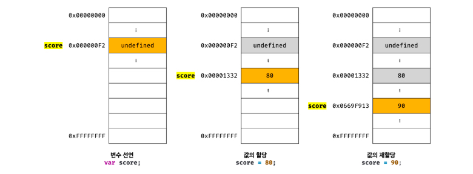
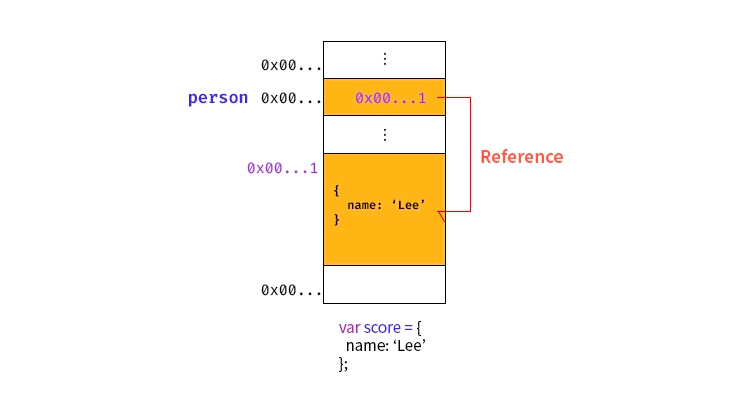
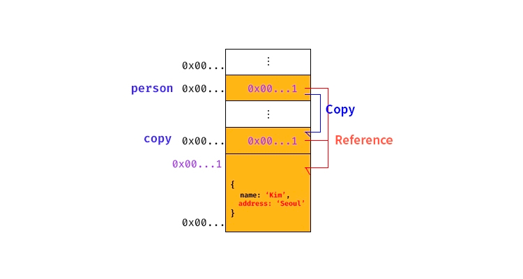

# 원시값과 객체의 비교
 원시값
- 변경 불가능
- 값을 변수에 할당하면 변수(메모리 공간)에는 실제 값이 저장
- 원시 값을 갖는 변수를 다른 변수에 할당하면 원본의 원시 값이 복사되어 전달(값에 의한 전달)


객체
- 변경 가능
- 객체를 변수에 할당하면(메모리 공간)에는 참조 값이 저장
- 객체를 가리키는 변수를 다른 변수에 할당하면 참조 값이 복사되어 전달(참조에 의한 전달)
## 원시 값
### 변경 불가능한 값
- 원시 타입의 값은 변경 불가능한 값으로 읽기 전용만 가능하다.
> 여기서 변경이 불가능하다는 것은? 변수가 아닌 값에 대한 진술!   
-> 원시 값 자체를 변경할 수 없다는 것이지 변수 값을 변경할 수 없다는 것이 아니다.
```js
// const 키워드를 사용해 선언한 변수는 재할당이 금지된다.
const o = {}
// const 키워드를 사용해 선언한 변수에 할당한 원시 값(상수)은 변경할 수 없다.
// 하지만 const 키워드를 사용해 선언한 변수에 할당한 객체는 변경할 수 있다.
o.a = 1
console.log(o) // {a:1}
```
- 원시 값은 어떤 일이 있어도 불변하기 때문에 데이터의 신뢰성을 보장한다.

- 재할당 이전의 원시 값을 변경하는 것이 아니라 새로운 메모리 공간을 확보하고 재할당한 원시 값을 저장한 후, 변수는 새롭게 재할당한 원시 값을 가리킨다.
  - 새로운 메모리 공간을 확보하고 재할당한 값을 저장한 후, 변수가 참조하던 메모리 공간의 주소를 변경한다. = 불변성
  - 불변성을 갖는 원시 값을 할당한 변수는 재할당 이외에 변수 값을 변경할 수 있는 방법이 없다.
- 변수가 참조하던 메모리 공간의 주소가 변경된 이유는 변수에 할당된 원시 값이 변경 불가능한 값이기 때문이다.

### 문자열과 불변성
- 자바스크립트의 문자열은 원시 타입이며, 변경이 불가능하다.
```js
var str = 'HELLO';
str = 'world';
```
#### 유사 배열 객체
- 마치 배열처럼 인덱스로 프로퍼티 값에 접근할 수 있고 length 프로퍼티를 갖는 객체
- 문자열은 마치 배열처럼 인덱스를 통해 각 문자에 접근할 수 있으며, length 프로퍼티를 갖기 때문에 유사 배열 객체이고 for문으로 순회할 수 있다.
```js
var str = 'string';

//문자열은 유사 배열이므로 배열과 유사하게 인덱스를 사용해 각 문자에 접근할 수 있다.
console.log(str[0]); //s

//원시 값인 문자열이 객체처럼 동작한다.
console.log(str.length); //6
console.log(str.toUpperCase()); //STRING

//하지만 문자열은 원시 값이므로 일부 문자를 변경할 수 없으며 이때 에러는 발생하지 않는다.
str[0] = 'S';

console.log(str); //string(대문자 S로 값을 변경하려했지만 원시 값이라서 변경되지 않는다.)
```
> 위 예문을 보면 예기치 못한 변경으로부터 자유롭기 때문에 데이터의 신뢰성을 보장하는 것을 알 수 있다.   
☝🏻 문자열은 원시 값이기 때문에 일부 문자를 변경할 수 없을 뿐 첫 번째 예시와 같이 새로운 문자열을 재할당하는 것은 물론 가능하다!

### 값에 의한 전달
- 변수에 원시 값을 갖는 변수를 할당하면 할당받는 변수(copy)에는 할당되는 변수(score)의 원시 값이 복사되어 전달된다.
- 정확히는 변수에는 값이 전달되는 것이 아니라 메모리 주소가 전달되기 때문에 변수와 같은 식별자는 값이 아니라 메모리 주소를 기억하고 있다.
- 결국은 두 변수의 원시 값은 서로 다른 메모리 공간에 저장된 별개의 값이 되어 어느 한쪽에서 재할당을 통해 값을 변경하더라도 서로 간섭할 수 없다는 것.
```js
var score = 80;

//copy 변수에는 score 변수의 값 80이 복사되어 할당된다.
var copy = score;

console.log(score,copy);     //80 80
console.log(score === copy); //true

//score 변수와 copy 변수의 값은 다른 메모리 공간에 저장된 **별개의 값**이다.
//따라서 score 변수의 값을 변경해도 copy 변수의 값에는 어떠한 영향도 주지 않는다.
score = 100;

console.log(score,copy);     //100 80
console.log(score === copy); //flase
```

## 객체
- 객체는 프로퍼티의 개수가 정해져 있지 않으며, 동적으로 추가되고 삭제할 수 있다. 또한 프로퍼티의 값에도 제약이 없다.
  - 따라서 객체는 원시 값과 같이 확보해야 할 메모리 공간의 크기를 사전에 정해 둘 수 없다.
### 변경 가능한 값
- 객체는 변경 가능한 값이다.
- 원시 값을 할당한 변수는 원시 값 자체를 값으로 가진다. 하지만 객체를 할당한 변수가 기억하는 메모리 주소를 통해 메모리 공간에 접근하면 참조 값에 접근할 수 있다.

```js
//할당이 이뤄지는 시점에 객체 리터럴이 해석되고, 그 결과 객체가 생성된다.
var person = {
name:'lee'
};

//person 변수에 저장되어 있는 참조 값으로 실제 객체에 접근한다.
console.log(person); //{name:'lee'}
```
>☝🏻 객체를 할당한 변수의 경우 '변수는 객체를 참조하고 있다' 또는 '변수는 객체를 가리키고 있다'고 표현한다.
-> person 변수는 객체 {name:'lee'}를 가리키고 있다
- 객체는 변경이 가능한 값으로 재할당 없이 직접 변경이 가능하다.
```js
var person = {
name:'lee'
};

//프로퍼티 값 갱신
person.name = 'kim';

//프로퍼티 동적 생성
person.address = 'Seoul';

console.log(person); //{name:'kim', address:'Seoul'}
```
- 객체를 생성하고 관리하는 방식은 매우 복잡하며 비용이 많이 든다.
  - 객체를 변경할 때마다 원시 값처럼 이전 값을 복사해 새롭게 생성한다면 명확하고 신뢰성이 확보되겠지만 객체는 크기가 매우 클 수도 있고, 원시 값처럼 크키가 일정하지도 않으며, 프로퍼티 값이 객체일 수도 있어서 복사해서 생성하는 비용이 많이 든다.
    - = 메모리 효율적 소비가 어렵고 성능이 나빠진다.
  - 메모리를 효율적으로 사용하고 객체를 복사해 생성하는 비용을 절약하여 성능을 향상시키기 위해 객체는 변경 가능한 값으로 설계되어 있다.
  	- 이러한 구조의 단점으로는 여러 개의 식별자가 하나의 객체를 공유할 수 있다는 것이다. (참조에 의한 전달)

>☝🏻 정리하기 전 얕은 복사와 깊은 복사에 대해 알아보자!
- 얕은 복사 : 객체에 중첩되어 있는 객체의 경우 참조 값을 복사한다 / 객체를 할당한 변수를 다른 변수에 할당하는 것
- 깊은 복사 : 객체에 중첩되어 있는 객체까지 모두 복사한다 / 원시 값을 할당한 변수를 다른 변수에 할당하는 것
```js
//깊은 복사
const v = 1;
const c1 = v;
console.log(c1 === v); //true
//얕은 복사
const o = {x : 1};
const c2 = o;
console.log(c2 === o); //true
```

### 참조에 의한 전달
- 객체를 가리키는 변수(원본)를 다른 변수(사본)에 할당하면 원본의 참조 값이 복사되어 전달된다.

- 원본과 사본은 저장된 메모리 주소는 다르지만 동일한 참조 값을 가지며 모두 동일한 객체를 가리킨다.
  - 두 개의 식별자가 하나의 객체를 공유하는 것.
  - 따라서 원본 또는 사본 중 어느 한쪽에서 객체를 변경(변수에 새로운 객체를 재할당하는 것이 아닌 객체의 프로퍼티 값을 변경, 추가, 삭제)하면 서로 영향을 주고 받는다.
```js
var person = {
    name:'lee'
};

//참조 값을 복사(얕은 복사) > copy와 person은 동일한 참조 값을 갖는다.
var copy = person;

//copy와 person은 동일한 객체를 참조한다.
console.log(copy === person); //true

//copy를 통해 객체를 변경한다.
copy.name = 'kim';

//person을 통해 객체를 변경한다.
person.address = 'Seoul';

//copy와 person은 동일한 객체를 가리킨다.
//따라서 어느 한쪽에서 객체를 변경하면 서로 영향을 주고 받는다.
console.log(person); //{name:'kim', address:'Seoul'}
console.log(copy);   //name:'kim', address:'Seoul'}
```
> ☝🏻 "값에 의한 전달"과 "참조에 의한 전달"은 식별자가 기억하는 메모리 공간에 저장되어 있는 값을 복사해서 전달한다는 면에서는 동일하다.   
다만 식별자가 기억하는 메모리 공간, 즉 변수에 젖아되어 있는 값이 원시 값이냐 참조 값이냐의 차이만 있을 뿐이다.
```js
var person1 = {
  name:'lee'
};

var person2 = {
  name:'lee'
};

console.log(person1 === person2);
//false > 내용은 같지만 다른 메모리에 저장된 별개의 객체
console.log(person1.name === person2.name);
//true > 값으로 평가될 수 있는 표현식이며 모두 원시 값 'lee'로 평가
```
