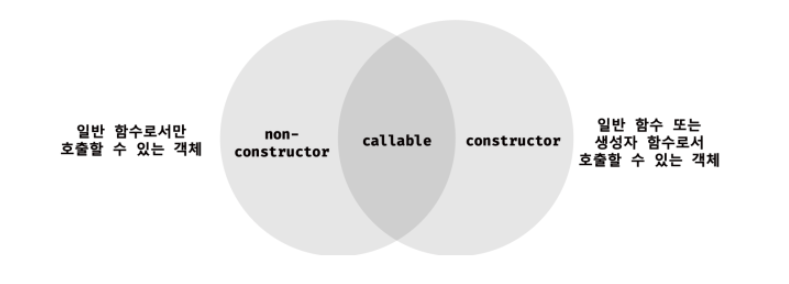

# 생성자 함수에 의한 객체 생성
## 생성자 함수
- new 연산자와 함께 호출하여 객체(인스턴스)를 생성하는 함수
> 인스턴스? : 생성자 함수에 의해 생성된 객체
## Object 생성자 함수
- new 연산자와 함께 Object 생성자 함수를 호출하면 빈 객체를 생성하여 반환한다.
- 프로퍼티 또는 메서드를 추가하여 객체를 완성할 수 있다.
```js
// 빈 객체 생성
const person = new Object();

// 프로퍼티 추가
person.name = 'lee';
person.sayHello = function () {
	console.log('Hi! My name is ' + this.name);
};

console.log(person); // {name: 'lee', sayHello: f}
person.sayHello(); // Hi! My name is lee
```
- Object 이외의 자바스크립트가 제공하는 빌트인 생성자 함수
  - String, Number, Boolean, Function, Array, Date, RegExp, Promise 등
  >😛 사실,, 객체를 생성하는 방법은 객체 리터럴을 사용하는 것이 더 간편하기 때문에 특별한 이유가 없다면 그다지 유용해 보이지 않는ㄷ..

## 생성자 함수
### 객체 리터럴에 의한 객체 생성 방식의 문제점
- 객체 생성 방식은 직관적이고 간편하다.
- 하지만, 이는 단 하나의 객체만 생성하기 때문에 동일한 프로퍼티를 갖는 객체를 여러 개 생성해야 하는 경우 매번 같은 프로퍼티를 기술해야 하기 때문에 비효율적이다.
```js
const circle1 = {
	radius: 5,
	getDiameter() {
		return 2 * this.radius;
	}
};

console.log(circle1.getDiameter()); // 10

const circle2 = {
	radius: 10,
	// 같은 프로퍼티가 반복되어 비효율적이다.
	getDiameter() {
		return 2 * this.radius;
	}
};

console.log(circle2.getDiameter()); // 20
```
- 객체는 프로퍼티를 통해 객체 고유의 상태를 표현하고 메서드를 통해 상태 데이터인 프로퍼티를 참조하고 조작하는 동작을 표현한다.
  - = 프로퍼티는 객체마다 프로퍼티 값이 다를 수 있지만 메서드는 내용이 동일한 경우가 일반적이다.
- 위 예제의 경우 circle1과 circle2의 프로퍼티 구조가 동일하다.   
객체 리터럴에 의해 객체를 생성하는 경우 프로퍼티 구조가 동일함에도 불구하고 매번 같은 프로퍼티와 메서드를 기술해야 한다.   
한두 개의 경우에는 기재할 수 있지만 수십 개의 객체를 생성해야 한다면 문제가 크다.
### 생성자 함수에 의한 객체 생성 방식의 장점
- 프로퍼티 구조가 동일한 객체 여러 개를 간편하게 생성할 수 있다.
```js
// 생성자 함수
function Circle(radius) {
	// 생성자 함수 내부의 this는 생성자 함수가 생성할 인스턴스를 가리킨다.
	this.radius = radius;
	this.getDiameter = function () {
		return 2 * this.radius;
	};
}

// 인스턴스의 생성
const circle1 = new Circle(5);
const circle2 = new Circle(10);

console.log(circle1.getDiameter()); // 10
console.log(circle2.getDiameter()); // 20
```

> ☝🏻 this?   
> - 객체 자신의 프로퍼티나 메서드를 참조하기 위한 자기 참조 변수   
> - this 바인딩은 함수 호출 방식에 따라 동적으로 결정
> - 
| 함수 호출 방식   | this가 가리키는 값(this 바인딩) |
|------------|------------------------|
| 일반 함수로서 호출 | 전역 객체                  |
|메서드로서 호출| 메서드를 호출한 객체(마침표 앞의 객체)|
|생성자 함수로서 호출|생성자 함수가 (미래에) 생성할 인스턴스|
```js
// 함수는 다양한 방식으로 호출될 수 있다.
function foo() {
    console.log(this);
}

// 일반적인 함수로서 호출
// 전역 객체는 브라우저 환경에서는 window, node.js 환경에서는 global을 가리킨다.
foo(); // window
const obj = { foo };
// 메서드로서 호출
obj.foo(); // obj
// 생성자 함수로서 호출
const inst = new foo(); // inst
```
- 일반 함수와 동일한 방법으로 생성자 함수를 정의하고 new 연산자와 함께 호출하면 해당 함수는 생성자 함수로 동작한다.
- new 연산자와 함께 생성자 함수를 호출하지 않으면 생성자 함수가 아니라 일반 함수로 동작한다.
```js
function Circle(radius) {
    this.radius = radius;
    this.getDiameter = function () {
        return 2 * this.radius;
    };
}

// new 연산자와 함께 호출하지 않으면 생성자 함수로 동작하지 않는다.
const circle3 = Circle(15);

// 일반 함수로서 호출된 Circle은 반환문이 없으므로 undefined를 반환한다.
console.log(circle3); // undefined

// 일반 함수로서 호출된 Circle 내의 this는 전역 객체를 가리킨다.
console.log(radius); // 15
```

### 생성자 함수의 인스턴스 생성 과정
#### 생성자 함수의 역할
1) 인스턴스를 생성
2) 생성된 인스턴스를 초기화(인스턴스 프로퍼티 추가 및 초기값 할당) >> 옵션
```js
// 생성자 함수
function Circle(radius) {
	// 인스턴스 초기화
	this.radius = radius;
	this.getDiameter = function () {
		return 2 * this.radius;
	};
}

// 인스턴스의 생성
const circle1 = new Circle(5);
```
- new 연산자와 함께 생성자 함수를 호출하면 자바스크립트 엔진은 다음과 같은 과정을 거쳐 암묵적으로 인스턴스를 생성하고 인스턴스를 초기화한 후 암묵적으로 인스턴스를 반환한다.
#### 인스턴스 생성 과정
1) 인스턴스 생성과 this 바인딩
- 암묵적으로 빈 객체(인스턴스)가 생성되고 this에 바인딩된다.
> ☝🏻 바인딩 : 식별자와 값을 연결하는 과정

- 이 처리는 런타임 이전에 실행된다.
```js
// 생성자 함수
function Circle(radius) {
	// 1. 암묵적으로 인스턴스가 생성되고 this에 바인딩된다.
	console.log(this); // Circle {}
	
	this.radius = radius;
	this.getDiameter = function () {
		return 2 * this.radius;
	};
}
```

2) 인스턴스 초기화
- 코드가 한 줄씩 실행되어 this에 바인딩되어 있는 인스턴스를 초기화한다.
  - = this에 바인딩되어 있는 인스턴스에 프로퍼티나 메서드를 추가하고 생성자 함수가 인수로 전달받은 초기값을 인스턴스 프로퍼티에 할당하여 초기화하거나 고정값을 할당한다.
```js
// 생성자 함수 
function Circle(radius) {
	// 1. 암묵적으로 인스턴스가 생성되고 this에 바인딩된다.
	console.log(this); // Circle {}
	// 2. this에 바인딩되어 있는 인스턴스를 초기화한다. (개발자가 기술해야함)
	this.radius = radius;
	this.getDiameter = function () {
	return 2 * this.radius;
	};
}
```

3) 인스턴스 반환
- 생성자 함수 내부의 모든 처리가 끝나면 완성된 인스턴스가 바인딩된 this가 암묵적으로 반환된다.
```js
// 생성자 함수
function Circle(radius) {
	// 1. 암묵적으로 인스턴스가 생성되고 this에 바인딩된다.
	console.log(this); // Circle {}
	// 2. this에 바인딩되어 있는 인스턴스를 초기화한다.
	this.radius = radius;
	this.getDiameter = function () {
		return 2 * this.radius;
	};
	// 3. 완성된 인스턴스가 바인딩된 this가 암묵적으로 반환된다.
}
```

- 만약, this가 아닌 다른 객체를 명시적으로 반환하면 this가 반환되지 못하고 return 문에 명시한 객체가 반환된다.
```js
// 생성자 함수
function Circle(radius) {
	// 1. 암묵적으로 인스턴스가 생성되고 this에 바인딩된다.
	console.log(this); // Circle {}
	// 2. this에 바인딩되어 있는 인스턴스를 초기화한다.
	this.radius = radius;
	this.getDiameter = function () {
		return 2 * this.radius;
	};
	// 3. 완성된 인스턴스가 바인딩된 this가 암묵적으로 반환된다.
	// 명시적으로 객체를 반환하면 암묵적인 this 반환이 무시된다.
	return {};
}

// 인스턴스의 생성
const circle = new Circle(1);
console.log(circle); // {}
```
- 하지만, 명시적으로 원시 값을 반환하면 원시 값 반환은 무시되고 암묵적으로 this가 반환된다.
```js
// 생성자 함수
function Circle(radius) {
	// 1. 암묵적으로 인스턴스가 생성되고 this에 바인딩된다.
	console.log(this); // Circle {}
	// 2. this에 바인딩되어 있는 인스턴스를 초기화한다.
	this.radius = radius;
	this.getDiameter = function () {
		return 2 * this.radius;
	};
	// 3. 완성된 인스턴스가 바인딩된 this가 암묵적으로 반환된다.
	// 명시적으로 원시 값를 반환하면 원시 값 반환은 무시되고 암묵적으로 this가 반환된다.
	return 100;
}

// 인스턴스의 생성
const circle = new Circle(1);
console.log(circle); // Circle {radius: 1, getDiameter: f}
```
- 위 예제들처럼 this가 아닌 다른 값을 반환하는 것은 생성자 함수의 기본 동작을 훼손하기에 return 문을 반드시 생략해야 한다.

### 내부 메서드 [[Call]]과 [[Construct]]
- 함수는 객체이므로 일반 객체와 동일하게 동작할 수 있다.
  - = 함수 객체는 일반 객체가 가지고 있는 내부 슬롯과 내부 메서드를 모두 가지고 있기 때문
```js
// 함수는 객체다.
function foo() {};

// 함수는 객체이므로 프로퍼티를 소유할 수 있다.
foo.prop = 10;

// 함수는 객체이므로 메서드를 소유할 수 있다.
foo.method = function () {
    console.log(this.prop)
}
foo.method() // 10
```
- 일반 객체는 호출할 수 없지만 함수는 호출할 수 있다.
- 함수로서 동작하기 위해 함수 객체만을 위한 [[Environment]], [[FormalParameters]] 등의 내부 슬롯과 [[Call]], [[Construct]] 같은 내부 메서드를 추가로 가지고 있다.
```js
function foo() {}

// 일반적인 함수로서 호출 : [[Call]]이 호출된다.
foo();

// 생성자 함수로서 호출 : [[Construct]]가 호출된다.
new foo();
```
- callable : 내부 메서드 [[Call]]을 갖는 함수 객체
  - 호출할 수 없는 객체는 함수 객체가 아니므로 함수 객체는 반드시 callable이어야 한다.
- Constructor : 내부 메서드 [[Construct]]를 갖는 함수 객체
- non-constructor : 내부 메서드 [[Construct]]를 갖지 않는 함수 객체
> 🔥 결론   
> - 함수 객체는 callable 이면서 constructor 이거나 callable 이면서 non-constructor다.
> - 모든 함수 객체는 호출할 수 있지만 모든 함수 객체를 생성자 함수로서 호출할 수 있는 것은 아니다.

### constructor와 non-constructor의 구분
- 함수 객체를 생성할 때 함수 정의 방식에 따라 constructor와 non-constructor를 구분한다.
- constructor : 함수 선언문, 함수 표현식, 클래스(클래스도 함수다)
- non-constructor : 메서드(ES6 메서드 축약 표현), 화살표 함수
```js
// 일반 함수 정의 : 함수 선언문, 함수 표현식
function foo() {}
const bar = function () {}
// 프로퍼티 x의 값으로 할당된 것은 일반 함수로 정의된 함수이며 이는 메서드로 인정하지 않는다.
const baz = {
    x: function() {}
}

// 일반 함수로 정의된 함수만이 constructor다.
new foo() // foo {}
new bar() // bar {}
new bax.x() // x {}

// 화살표 함수 정의
const arrow = () => {}
new arrow() // TypeError: arrow is not a constructor

// 메서드 정의: ES6의 메서드 축약 표현만 메서드로 인정
const obj = {
    x() {}
}
new obj.x() // TypeError: arrow is not a constructor
```
### new 연산자
- 일반 함수와 생성자 함수에 특별한 형식적 차이는 없다.
- new 연산자와 함께 함수를 호출하면 해당 함수는 생성자 함수로 동작한다.
- new 연산자와 함께 호출하는 함수는 non-constructor가 아닌 constructor이여야 한다.
```js
// 생성자 함수로서 정의하지 않은 일반 함수
function add(x,y) {
    return x + y
}

// 생성자 함수로서 정의하지 않은 일반 함수를 new 연산자와 함께 호출
let inst = new add()

// 함수가 객체를 반환하지 않으므로 반환문이 무시된다.
console.log(inst) // {}

// 객체를 반환하는 일반 함수
function createUser(name, role) {
    return {name, role}
}

// 일반 함수를 new 연산자와 함께 호출
inst = new CreateUser('lee', 'admin')
console.log(inst) // {name: 'lee', role: 'admin'}
```
- 일반 함수와 생성자 함수에 특별한 형식적 차이가 없기 때문에 생성자 함수는 일반적으로 첫 문자를 대문자로 기술하는 파스칼 케이스로 명명하여 일반 함수와 구별할 수 있도록 노력한다.

### new.target
- 생성자 함수와 일반 함수를 구분하기 위해 파스칼 케이스 컨벤션을 사용하더라도 실수가 발생할 수 있기 때문에 이러한 위험성을 회피하기 위해 ES6에서 지원
- this와 유사하게 constructor인 모든 함수 내부에서 암묵적인 지역 변수와 같이 사용되며 메타 프로퍼티라고 부른다.
> 🔥 IE는 지원하지 않으므로 주의!

- new 연산자와 함께 생성자 함수로서 호출되면 함수 내부의 new.target은 함수 자신을 가리킨다.
	- new 연산자 없이 일반 함수로서 호출된 함수 내부의 new.target은 undefined이다.
```js
// 생성자 함수
function Circle(radius) {
	// new 연산자와 함께 호출되지 않는다면 new.target은 undefined다.
	if(!new.target) {
		return new Circle(radius);
	}
	
	this.radius = radius;
	this.getDiameter = function () {
		return 2 * this.radius;
	};
}

// new 연산자 없이 생성자 함수를 호출하여도 new.target을 통해 생성자 함수로서 호출된다.
const circle = Circle(5);
console.log(circle.getDiameter()); // 10
```

## 참고
- 대부분의 빌트인 생성자 함수(Object, String, Number, Boolean, Function, Array, Date, RegExp, Promise 등)는 new 연산자와 함께 호출되었는지를 확인한 후 적절한 값을 반환한다.
- Object, Function : new 연산자 없이 호출해도 new 연산자와 함께 호출했을 때와 동일하게 작동
```js
let obj = new Object()
console.log(obj) // {}

obj = Object()
console.log(obj) // {}

let f = new Function('x', 'return x ** x')
console.log(f) // f anonymous(x) { return x ** x }

f = Function('x', 'return x ** x')
console.log(f) // f anonymous(x) { return x ** x }
```
- String, Number, Boolean : new 연산자 없이 호출하면 문자열, 숫자, 불리언 값을 반환
```js
const str = String(123)
console.log(str, typeof str) // 123 string

const num = Number('123')
console.log(num, typeof num) // 123 number

const bool = Boolean('true')
console.log(bool, typeof bool) // true boolean
```