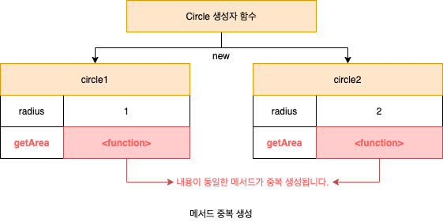
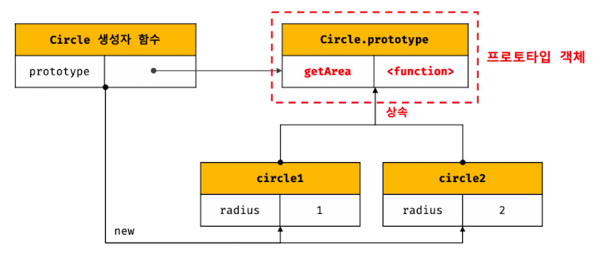
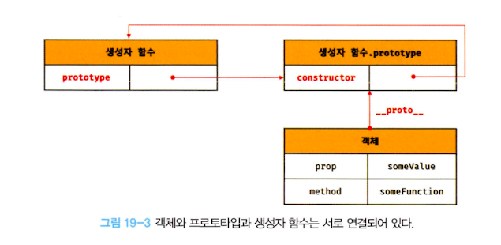

# 프로토타입
- 자바스크립트는 객체 기반의 프로그래밍 언어이며 <b>자바스크립트를 이루고 있는 거의 "모든 것"이 객체</b>다.
  - 원시 타입의 값을 제외한 나머지 값들(함수, 배열, 정규 표현식 등)은 모두 객체다.

## 객체지향 프로그래밍
- 프로그램을 명령어 또는 함수의 목록으로 보는 전통적인 명령형 프로그래밍의 절차지향적 관점에서 벗어나 <b>여러 개의 독립적 단위, 즉 객체의 집합으로 프로그램을 표현</b>하려는 프로그래밍 패러다임

> #### 추상화
> - 사람에게는 {이름, 주소, 성별, 나이} 등의 다양한 속성이 있으나 우리가 구현하려는 프로그램에서는 사람의 {이름, 주소}라는 속성에만 관심이 있다고 가정하자.   
> 이처럼 다양한 속성 중에서 프로그램에 필요한 속성만 간추려 내어 표현하는 것을 <b>추상화</b>라 한다.

```js
// 이름과 주소 속성을 갖는 객체
const person = {
  name: 'lee',
  address: 'seoul'
}
console.log(person) // {name: 'lee', address: 'seoul'}
```
> #### 객체
> - 속성을 통해 여러 개의 값을 하나의 단위로 구성한 복합적인 자료구조를 객체라 한다.

- 객체지향 프로그래밍은 독립적인 객체의 집합으로 프로그램을 표현하려는 프로그래밍 패러다임이다.

```js
const circle = {
  radius: 5, // 반지름(상태를 나타내는 데이터 = 프로퍼티)
  
  // 원의 지름: 2r > 동작 = 메서드
  getDiameter() {
    return 2 * this.radius
  },

  // 원의 둘레: 2nr > 동작 = 메서드
  getPerimeter() {
    return 2 * Math.PI * this.radius
  },

  // 원의 넓이: nrr > 동작 = 메서드
  getArea() {
    return Math.PI * this.radius ** 2
  }
}
```
- 객체는 상태 데이터와 동작을 하나의 논리적인 단위로 묶은 복합적인 자료구조다.
  - 상태 데이터를 프로퍼티, 동작을 메서드라 부른다.

## 상속과 프로토타입
### 상속
- 객체지향 프로그래밍의 핵심 개념으로 어떤 객체의 프로퍼티 또는 메서드를 다른 객체가 상속받아 그대로 사용할 수 있는 것을 말한다.
- 자바스크립트는 프로토타입을 기반으로 상속을 구현하여 불필요한 중복을 제거한다.
```js
// 생성자 함수
function Circle(radius) {
  this.radius = radius
  this.getArea = function () {
    return Math.PI * this.radius ** 2
  }
  
  // 반지름이 1인 인스턴스 생성
  const circle1 = new Circle(1)
  // 반지름이 2인 인스턴스 생성
  const circle2 = new Circle(2)
  
  // Circle 생성자 함수는 인스턴스를 생성할 때마다 동일한 동작을 하는
  // getArea 메서드를 중복 생성하고 모든 인스턴스가 중복 소유한다.
  // getArea 메서드는 하나만 생성하여 모든 인스턴스가 공유해서 사용하는 것이 바람직하다.
  console.log(circle1.getArea() === circle2.getArea()) // false
}
```

- 생성자 함수에 의해 생성된 모든 인스턴스가 동일한 메서드를 중복 소유하는 것은 메모리를 불필요하게 낭비한다.
- 인스턴스를 생성할 때마다 메서드를 생성하므로 퍼포먼스에도 악영향을 준다.

### 프로토타입 기반의 상속
```js
// 생성자 함수
function Circle(radius) {
  this.radius = radius
}

// Circle 생성자 함수가 생성한 모든 인스턴스가 getArea 메서드를
// 공유해서 사용할 수 있도록 프로토타입에 추가한다.
// 프로토타입은 Circle 생성자 함수의 prototype 프로퍼티에 바인딩되어 있다.
Circle.prototype.getArea = function () {
  return Math.PI * this.radius ** 2
}

// 인스턴스 생성
const circle1 = new Circle(1)
const circle2 = new Circle(2)

// Circle 생성자 함수가 생성한 모든 인스턴스는 부모 객체의 역할을 하는
// 프로토타입 Circle.prototype으로부터 getArea 메서드를 상속받는다.
// 즉, Circle 생성자 함수가 생성하는 모든 인스턴스는 하나의 getArea 메서드를 공유한다.
console.log(circle1.getArea() === circle2.getArea()) // true
```


## 프로토타입 객체
- 객체지향 프로그래밍의 근간을 이루는 객체 간 상속을 구현하기 위해 사용한다.
- 어떤 객체의 부모 객체의 역할을 하는 객체로서 다른 객체에 공유 프로퍼티(메서드 포함)을 제공한다.
- 프로토타입을 상속받은 자식 객체는 부모 객체의 프로퍼티를 자신의 프로퍼티처럼 자유롭게 사용할 수 있다.
- 모든 객체는 [[Prototype]]이라는 내부 슬롯을 가지며 이 내부 슬롯의 값은 프로토타입의 참조다.
  - [[Prototype]]에 저장되는 프로토타입은 객체 생성 방식에 의해 결정된다.
    - 객체가 생성될 때 객체 생성 방식에 따라 프로토타입이 결정되고 [[Prototype]]에 저장된다.
- 모든 객체는 하나의 프로토타입을 갖는다. 그리고 모든 프로토타입은 생성자 함수와 연결되어 있다.
  - 객체와 프로토타입과 생성자 함수는 다음 그림과 같이 서로 연결되어 있다.


### __proto__ 접근자 프로퍼티
- 모든 객체는 __proto__ 접근자 프로퍼티를 통해 자신의 프로토타입, 즉 [[Prototype]] 내부 슬롯에 간접적으로 접근할 수 있다.
#### __proto__ 는 접근자 프로퍼티다.
- 자바스크립트는 원칙적으로 내부 슬롯과 내부 메서드에 직접적으로 접근하거나 호출할 수 있는 방법을 제공하지 않으며 __proto__를 통해 간접적으로 접근할 수 있다.
- __proto__ 접근자 프로퍼티를 통해 프로토타입에 접근하면 내부적으로 getter 함수인 [[Get]]이 호출된다.
- __proto__ 접근자 프로퍼티를 통해 새로운 프로토타입을 할당하면 setter 함수인 [[Set]]이 호출된다.
```js
const obj = {}
const parent = { x: 1}

// getter
obj.__proto__

// setter
obj.__proto__ = parent

console.log(obj.x) // 1
```
#### __proto__ 접근자 프로퍼티는 상속을 통해 사용된다.
```js
const person = { name: 'lee' }

// person 객체는 __proto__ 프로퍼티를 소유하지 않는다.
console.log(person.hasOwnProperty('__proto__')) // false

// __proto__ 프로퍼티는 모든 객체의 프로토타입 객체인 Object.prototype의 접근자 프로퍼티다.
console.log(Object.getOwnPropertyDescriptor(Object.prototype, '__proto__')) // {get:f, set:f,,,,}

// 모든 객체는 Object.prototype의 접근자 프로퍼티 __proto__를 상속받아 사용할 수 있다.
console.log({}.__proto__ === Object.prototype) // true
```

#### __proto__ 접근자 프로퍼티를 통해 프로토타입에 접근하는 이유
- 상호 참조에 의해 프로토타입 체인이 생성되는 것을 방지하기 위해서이다.
```js
const person = {}
const child = {}

// child의 프로토타입을 parent로 설정
child.__proto__ = parent
// parent의 프로토타입을 child로 설정
parent.__proto__ = child // TypeError
```
- 프로토타입 체인은 단방향 링크드 리스트로 구현되어야 한다.
  - 프로퍼티 검색 방향이 한쪽 방향으로만 흘러가야 한다.
- 아무런 체크없이 무조건적으로 프로토타입을 교체할 수 없도록 __proto__ 접근자 프로퍼티를 통해 프로토타입에 접근하고 교체하도록 구현되어 있다.

#### __proto__ 접근자 프로퍼티를 코드 내에서 직접 사용하는 것은 권장하지 않는다.
- 모든 객체가 __proto__ 접근자 프로퍼티를 사용할 수 있는 것은 아니기 때문이다.
- 직접 상속을 통해 Object.prototype을 상속받지 않는 객체를 생성할 수 있기 때문이다.
```js
// obj는 프로토타입 체인의 종점이다. 따라서 Object.__proto__를 상속받을 수 없다.
const obj = Object.create(null)

console.log(obj.__proto__) // undefined
console.log(Object.getPrototypeOf(obj)) // null

const obj1 = {}
const parent = { x: 1 }

// obj1 객체의 프로토타입을 취득
Object.getPrototypeOf(obj1) // obj.__proto__
// obj2 객체의 프로토타입을 교체
Object.setPrototypeOf(parent) // obj.__proto__ = parent

console.log(obj.x) // 1
```
### 함수 객체의 prototype 프로퍼티
- 함수 객체만이 소유하는 prototype 프로퍼티는 생성자 함수가 생성할 인스턴스의 프로토타입을 가리킨다.
```js
// 함수 객체는 prototype 프로퍼티를 소유한다.
(function () {}).hasOwnProperty('prototype') // true

// 일반 객체는 prototype 프로퍼티를 소유하지 않는다.
({}).hasOwnProperty('prototype') // false
```
- prototype 프로퍼티는 생성자 함수가 생성할 객체의 프로토타입을 가리킨다.
  - 생성자 함수로서 호출할 수 없는 함수(화살표 함수, ES6 메서드 축약 표현)로 정의한 메서드는 prototype 프로퍼티를 소유하지 않으며 프로토타입도 생성하지 않는다.

| 구분                 | 소유    | 값         | 사용 주체 | 사용 목적                           |
|--------------------|-------|-----------|-------|---------------------------------|
| __proto__ 접근자 프로퍼티 | 모든 객체 | 프로토타입의 참조 | 모든 객체 | 객체가 자신의 프로토타입에 접근 또는 교체하기 위해 사용 |
| prototype 프로퍼티 | constructor | 프로토타입의 참조 | 생성자 함수 | 생성자 함수가 자신이 생성할 객체(인스턴스)의 프로토타입을 할당하기 위해 사용 |

```js
// 생성자 함수
function Person(name) {
  this.name = name
}

const me = new Person('Lee')

// 결국 Person.prototype과 me.__proto__는 결국 동일한 프로토타입을 가리킨다.
console.log(Person.prototype === me.__proto__) // true
```
### 프로토타입의 constructor 프로퍼티와 생성자 함수
- 모든 프로토타입은 constructor 프로퍼티를 갖는다.
- 이 constructor 프로퍼티는 prototype 프로퍼티로 자신을 참조하고 있는 생성자 함수를 가리킨다.
```js
// 생성자 함수
function Person(name) {
  this.name = name
}

const me = new Person('lee')

// me 객체의 생성자 함수는 Person이다.
console.log(me.constructor = Person) // true
```

## 리터럴 표기법에 의해 생성된 객체의 생성자 함수와 프로토타입
- 생성자 함수에 의해 생성된 인스턴스는 프로토타입의 cosntructor 프로퍼티에 의해 생성자 함수와 연결된다.
```js
// obj 객체를 생성한 생성자 함수는 Object다.
const obj = new Object()
console.log(obj.constructor === Object) // true

// add 함수 객체를 생성한 생성자 함수는 Function이다.
const add = new Function('a', 'b', 'return a+b')
console.log(add.constructor = Function) // true

// 생성자 함수
function Person(name) {
  this.name = name
}

// me 객체를 생성한 생성자 함수는 Person이다.
const me = new Person('lee')
console.log(me.constructor === Person) // true
```
- 하지만 리터럴 표기법에 의한 객체 생성 방식과 같이 명시적으로 new 연산자와 함께 생성자 함수를 호출하여 인스턴스를 생성하지 않는 객체 생성 방식도 있다.
```js
// 객체 리터럴
const obj = {}

// 함수 리터럴
const add = function (a, b) { return a + b }

// 배열 리터럴
const arr = [ 1, 2, 3 ]

// 정규 표현식 리터럴
const regexp = /is/ig
```
- 리터럴 표기법에 의해 생성된 객체도 물론 프로토타입이 존재하지만 프로토타입의 constructor 프로퍼티가 가리키는 생성자 함수가 반드시 객체를 생성한 생성자 함수라고 단정할 수는 없다.
```js
// obj 객체는 Object 생성자 함수로 생성한 객체가 아니라 객체 리터럴로 생성했다.
const obj = {}

// 하지만 obj 객체의 생성자 함수는 Object 생성자 함수다.
console.log(obj.constructor === Object) // true
```
- Object 생성자 함수에 인수를 전달하지 않거나 undefined 또는 null을 인수로 전달하면서 호출하면 내부적으로는 추상 연산을 호출하여 Object.prototype을 프로토타입으로 갖는 빈 객체를 생성한다.
