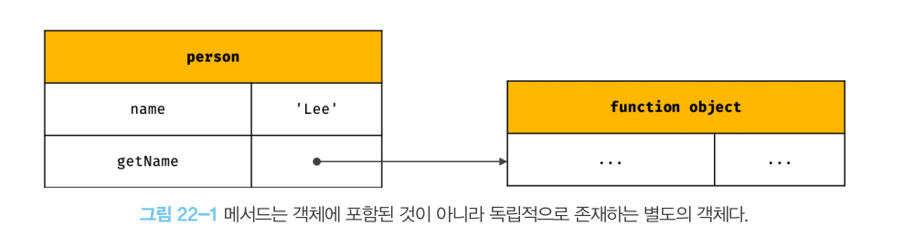

 # this
 - 자신이 속한 객체 또는 자신이 생성할 인스턴스를 가리키는 자기 참조 변수
 - this를 통해 자신이 속한 객체 또는 자신이 생성할 인스턴스의 프로퍼티나 메서드를 참조할 수 있다.
 - 자바스크립트 엔진에 의해 암묵적으로 생성되며 코드 어디서든 참조할 수 있다.
 - this가 가리키는 값, 즉 this 바인딩은 함수 호출 방식에 의해 동적으로 결정된다.
```js
// 객체 리터럴
const circle = {
  radius: 5,
  getDiameter() {
    return 2 * this.radius
  }
}

console.log(circle.getDiameter()) // 10
```
```js
// 생성자 함수
function Circle(radius) {
  this.radius = radius
}
Circle.prototype.getDiameter = function () {
  return 2 * this.radius
}

// 인스턴스 생성
const circle = new Circle(5)
console.log(circle.getDiameter()) // 10
```
 - 자바스크립트이 this는 함수가 호출되는 방식에 따라 this 바인딩이 동적으로 결정된다.
```js
// 전역에서 this
console.log(this) // window

function square(number) {
  console.log(this) // window
  return number * number
}

const person = {
  name: 'lee',
  getName() {
    // 메서드 내부에서 this는 메서드를 호출한 객체를 가리킨다.
    console.log(this) // { name: 'lee', getName: f }
    return this.name
  }
}
console.log(person.getName()) // lee

function Person(name) {
  this.name = name
  // 생성자 함수 내부에서 this는 생성자 함수가 생성할 인스턴스를 가리킨다.
  console.log(this) // Person { name: 'lee' }
}
const me = new Person('lee')
```

## 함수 호출 방식과 this 바인딩
- this 바인딩은 함수 호출 방식, 즉 함수가 어떻게 호출되었는지에 따라 동적으로 결정된다.
### 일반 함수 호출
- 전역 객체가 바인딩
```js
function foo() {
  console.log("foo's this: ", this) // window
  function bar() {
    console.log("bar's this: ", this) // window
  }
  bar()
}
foo()
```
> 일반함수에서 this는 의미가 없다.

### 메서드 호출
- 마침표 연산자 앞에 기술한 객체가 바인딩된다.
- 메서드 내부의 this는 메서드를 소유한 객체가 아닌 메서드를 호출한 객체에 바인딩 된다.
```js
const person = {
  name: 'lee',
  getName() {
    // 메서드 내부의 this는 메서드를 호출한 객채에 바인딩된다.
    return this.name
  }
}

// 메서드 getName을 호출한 객체는 person이다.
console.log(person.getName()) // lee
```


### 생성자 함수 호출
- 생성자 함수가 생성할 인스턴스가 바인딩된다.
```js
// 생성자 함수
function Circle(radius) {
  // 생성할 인스턴스를 가리킨다.
  this.radius = radius
  this.getDiameter = function () {
    return 2 * this.radius
  }
}

// 인스턴스 생성
const circle1 = new Circle(5)
const circle2 = new Circle(10)

console.log(circle1.getDiameter()) // 10
console.log(circle2.getDiameter()) // 20
```

### function.prototype.apply/ca//bind 메서드에 의한 간접 호출
- 이들 메서드는 모든 함수가 상속받아 사용할 수 있다.
```js
/**
 * 주어진 this 바인딩과 리스트 배열을 사용하여 함수를 호출한다.
 * @param thisArg - this로 사용할 객체
 * @param argsArray - 함수에게 전달할 인수 리스트의 배열 또는 유사 배열 객체
 * @returns 호출된 함수의 반환값
 */
Function.prototype.apply(thisArg[, argsArray])

/**
 * 주어진 this 바인딩과 ,로 구분된 인수 리스트를 사용하여 함수를 호출한다.
 * @param thisArg - this로 사용할 객체
 * @param arg1, arg2, ... - 함수에게 전달할 인수 리스트
 * @returns 호출된 함수의 반환값
 */
Function.prototype.apply(thisArg[, arg1[, arg2[, ...]]])
```
```js
function getThisBinding() {
  return this
}

// this로 사용할 객체
const thisArg = { a : 1 }
console.log(getThisBinding()) // window

console.log(getThisBinding().apply(thisArg)) // { a : 1 }
console.log(getThisBinding().call(thisArg)) // { a : 1 }
```
- apply와 call 메서드의 본질적인 기능은 함수를 호출하는 것이다.
- 호출할 함수에 인수를 전달하는 방식만 다를 뿐 동일하게 동작한다.

#### apply
- 호출할 함수의 인수를 배열로 묶어 전달한다.
#### call
- 호출할 함수의 인수를 쉼표로 구분한 리스트 형식으로 전달한다.
#### bind
- 함수를 호출하지 않고 this로 사용할 객체만 전달한다.
```js
function getThisBinding() {
  return this
}

// this로 사용할 객체
const thisArg = { a : 1 }
console.log(getThisBinding.bind(thisArg)) // getThisBinding
console.log(getThisBinding.bind(thisArg)()) // { a: 1 }
```

| 함수 호출 방식                                         | this 바인딩             |
|--------------------------------------------------|----------------------|
| 일반 함수 호출                                         | 전역 객체                |
| 메서드 호출                                           | 메서드를 호출한 객체          |
| 생성자 함수 호출                                        | 생성자 함수가 생성할 인스턴스     |
| Function.prototype.apply/call/bind 메서드에 의한 간접 호출 | 메서드에서 첫번째 인수로 전달한 객체 |